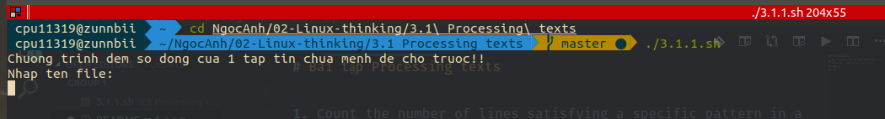
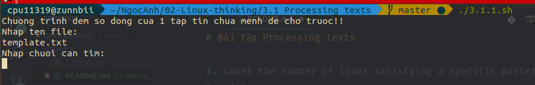
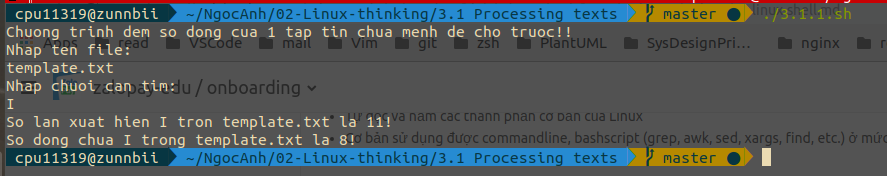
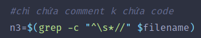
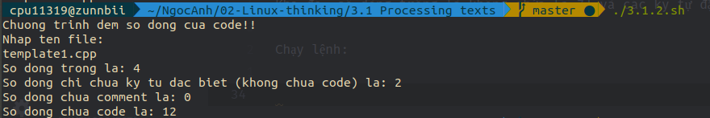

# Bài tập Processing texts

<!-- TOC -->

- [Bài tập Processing texts](#b%C3%A0i-t%E1%BA%ADp-processing-texts)
  - [1. Đếm từ](#1-%C4%91%E1%BA%BFm-t%E1%BB%AB)
  - [2. Đếm dòng code](#2-%C4%91%E1%BA%BFm-d%C3%B2ng-code)

<!-- /TOC -->

1. Count the number of lines satisfying a specific pattern in a log file.
2. Calculate KLOC of code C/C++ files in a directory.

## 1. Đếm từ

Chạy lệnh:

Nhập tên file và chuỗi cần tìm:

Kết quả:

Chương trình chạy ra 2 kết quả, gồm đếm số lần từ đó xuất hiện và số dòng chứa từ đó.

## 2. Đếm dòng code

Theo quy ước trong code C, dòng có dấu // là dòng chứa comment. Suy ra để tính dòng chứa code, ta cần tính được số dòng chỉ chứa comment không chứa code bằng câu lệnh:

Trong đó dấu **^** để ràng buộc ký tự // đứng đầu dòng, với \s là thay cho dấu \*space* và dấu * biểu thị số lượng không cố định.

Khi đó, số dòng trống là không chứa [a-Z] và các ký tự đặc biệt.

Chạy lệnh:

