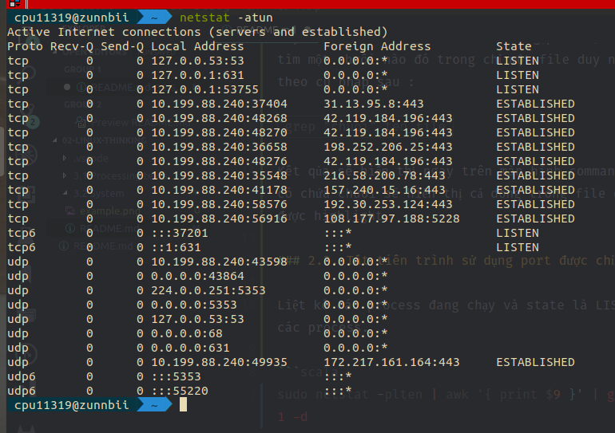
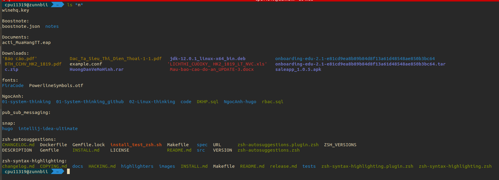
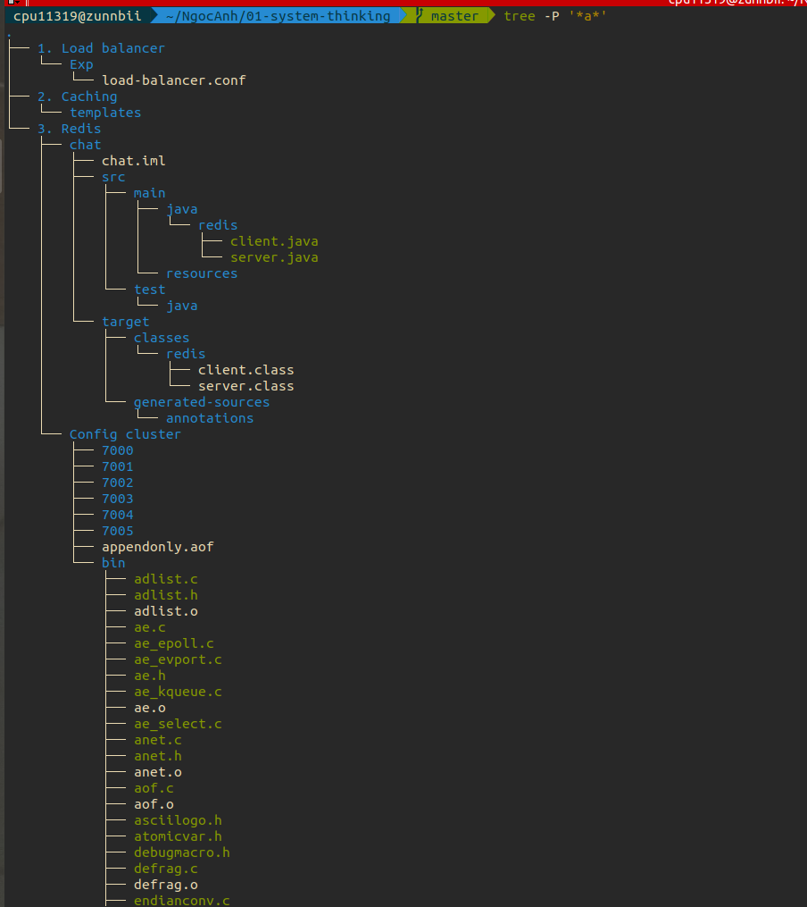
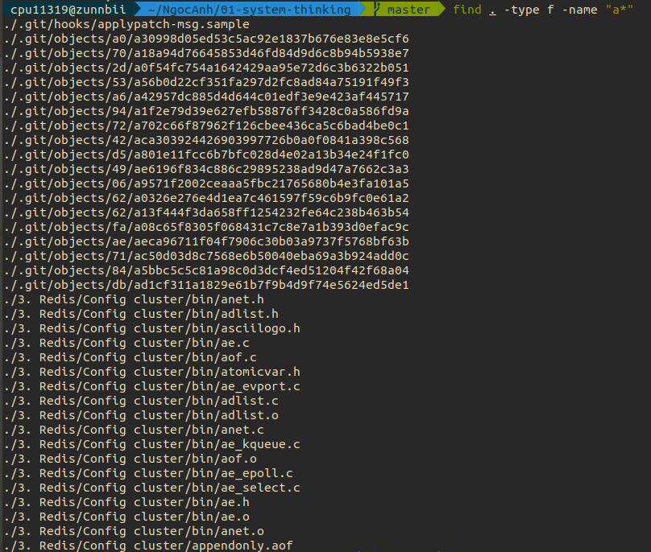
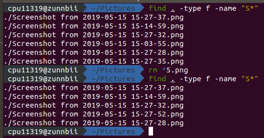
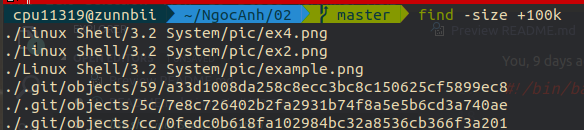
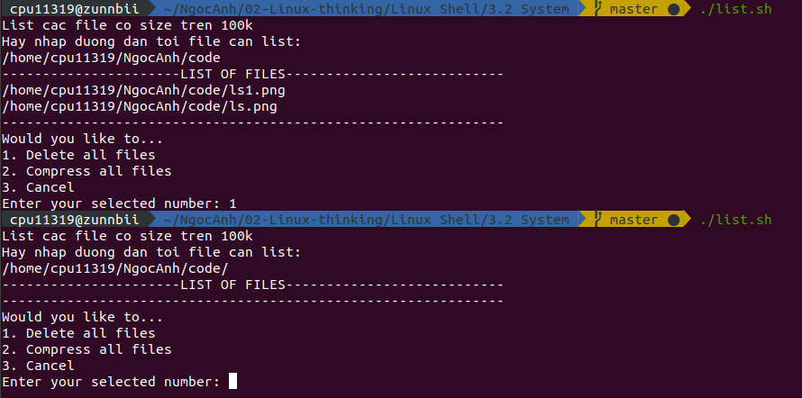

# System

----

<!-- TOC -->

- [System](#system)
  - [1. Kill multiple processes following a patterns](#1-kill-multiple-processes-following-a-patterns)
  - [2. Kill processes opening a specific port](#2-kill-processes-opening-a-specific-port)
    - [2.1. Lệnh netstat](#21-l%E1%BB%87nh-netstat)
    - [2.2. Lệnh grep](#22-l%E1%BB%87nh-grep)
    - [2.3. Tắt tiến trình sử dụng port được chỉ định](#23-t%E1%BA%AFt-ti%E1%BA%BFn-tr%C3%ACnh-s%E1%BB%AD-d%E1%BB%A5ng-port-%C4%91%C6%B0%E1%BB%A3c-ch%E1%BB%89-%C4%91%E1%BB%8Bnh)
  - [3. List opennned ports, handles](#3-list-opennned-ports-handles)
  - [4. Find files via regular expressions, and remove them](#4-find-files-via-regular-expressions-and-remove-them)
    - [4.1. Tìm file](#41-t%C3%ACm-file)
    - [4.2. Xóa file](#42-x%C3%B3a-file)
  - [5. List, one at a time, all files larger than 100K in the /home/username directory tree. Give the user the option to delete or compress the file, then proceed to show the next one. Write to a logfile the names of all deleted files and the deletion times](#5-list-one-at-a-time-all-files-larger-than-100k-in-the-homeusername-directory-tree-give-the-user-the-option-to-delete-or-compress-the-file-then-proceed-to-show-the-next-one-write-to-a-logfile-the-names-of-all-deleted-files-and-the-deletion-times)
    - [5.1. Lệnh find](#51-l%E1%BB%87nh-find)

<!-- /TOC -->

----

## 1. Kill multiple processes following a patterns

Dùng lệnh `ps` để liệt kê các process đang hoạt động:

```c
ps <option>
```

Option thường được sử dụng là -aux:

* a. Xem tất cả các process được tạo bởi mọi user.
* u. Xuất tất cả thông tin chi tiết liên quan tới mỗi process.
* x. Liệt kê cả những process không chỉ bởi user mà còn bởi deamons.
* Ví dụ:
  * `ps -eaf`

Dùng lệnh grep để lọc theo pattern:

* Ví dụ:
  * `grep "xyz"`
  * `grep -v grep`

Kết hợp awk để lấy PID của các process đã lọc:

* Ví dụ:
  * `awk '{BEGIN { print "Start" } /linux/ { print } END { print "Finish" } }'`

Sau khi kết hợp, lệnh sẽ là:

```scala
ps -eaf  | grep "name_process" | grep -v grep | awk 'print $2' | xargs kill
```

## 2. Kill processes opening a specific port

### 2.1. Lệnh netstat

Cú pháp: `netstat -<command>`

Trong đó command là:

* -a
  * Lệnh này thật ra chỉ để kiểm tra cho vui và tổng quát chứ không có nhiều ý nghĩa nhiều. Nên admin thường không dùng lệnh này để monitor nhưng nó cũng là một lệnh chúng ta cần biết.
* -at
  * Kiểm tra các port đang sử dụng phương phức TCP
* -au
  * Kiểm tra các port đang sử dụng phương phức UDP
* -l
  * Kiểm tra các port đang ở trạng thái listening
* -lt
  * Kiểm tra các port đang listen dùng phương thức TCP
* -lu
  * Kiểm tra các port đang listen dùng phương thức UDP
* -plnt
  * Kiểm tra được port đang lắng nghe sử dụng dịch vụ gì?
* -rn
  * Hiển thị bảng định tuyến
* -an | grep :80 | sort
  * Kiểm tra những kết nối thông qua port 80 và sắp xếp.
* -np | grep SYN_REC | wc -l
  * Kiểm tra có bao nhiêu gói SYN_REC trên server. Đối với con số thì tùy thuộc vào server của bạn, ví dụ nếu mỏi ngày có tầm 20 đến 30 kết nối, bổng dưng một ngày lên cả 100 -> 1000 kết nối thì bạn hiểu rồi đó -> server bị ddos.

### 2.2. Lệnh grep

Đây là cách sử dụng cơ bản và hay gặp nhất, nếu đơn giản bạn muốn tìm một chuỗi nào đó trong chỉ một file duy nhất thì có thể dùng theo cú pháp sau :

`grep "chuoi" ten_file`

Kết qủa sẽ hiển thị ngay trên màn hình command line theo dòng nào có chứa chuỗi sẽ hiển thị cả dòng trong file đó ra và chuỗi đó sẽ được highlight.

### 2.3. Tắt tiến trình sử dụng port được chỉ định

Liệt kê các process đang chạy với state là LISTEN và tách PID của các process.

```scala
sudo netstat -plten | awk '{ print $9 }' | grep "[0-9]" | cut -f 1 -d | xargs kill
```

## 3. List opennned ports, handles

Sử dụng lệnh netstat tương tự như phần 2:



## 4. Find files via regular expressions, and remove them

### 4.1. Tìm file

* Liệt kê file có chứa chuỗi được cho trước:

```scala
ls *chuoi*
```

* Ví dụ:



* Liệt kê file theo dạng tree

```scala
tree -P '*abc*'
```

* Ví dụ:



* Tìm theo cách liệt kê tên file và direct

```scala
find . -type f -name "abc*"
```

* Ví dụ:



### 4.2. Xóa file

Dùng lệnh rm \*chuoi* để xóa các file có định dạng như chuoi. Ví dụ:



## 5. List, one at a time, all files larger than 100K in the /home/username directory tree. Give the user the option to delete or compress the file, then proceed to show the next one. Write to a logfile the names of all deleted files and the deletion times

### 5.1. Lệnh find

Thực hiện find các file có size trên 100k:



Chạy code:



Trước khi chạy, thư mục /home/cpu11319/NgocAnh/code/ có 2 file trên 100k. Sau khi chọn xóa tất cả, không còn file nào có size trên 100k.