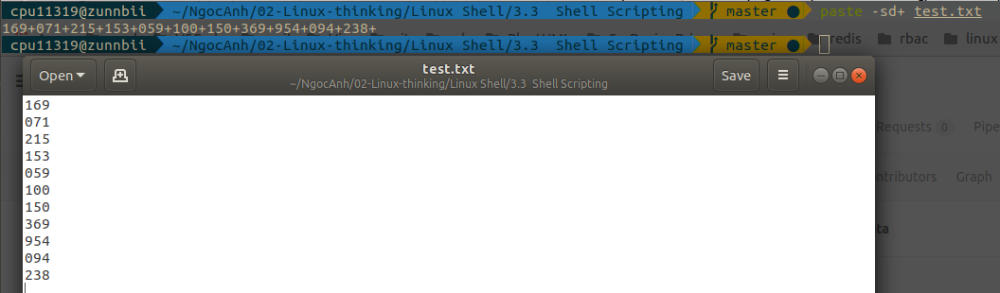
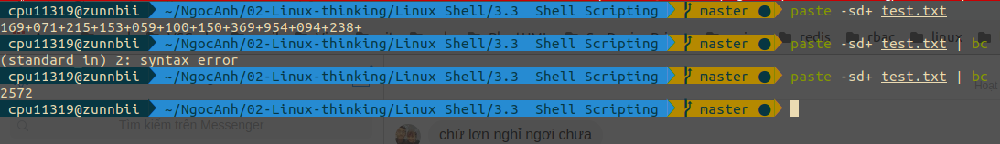
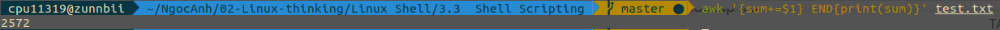

# Bài tập tính tổng trong file

**Đề bài:** Give you a text file which contains several numbers (may be serveral thousand), each on it's own line. You task is write a script which print the sum of all numbers in the file. I'm looking for effficient solution

**Ý tưởng 1:** File có cấu trúc gồm nhiều dòng, mỗi dòng 1 số, ta chuyển nhiều dòng thành 1 dòng, xen giữa các dòng là dấu "+" sau đó gọi lệnh `bc` để system thực hiện tính toán dòng đó.

Sau đó thực hiện tính toán:

**Lưu ý:** file không được có dòng trống cuối file, nếu không sẽ báo lỗi như dòng 2.

**Ý tưởng 2:** Trong Linux, tham số lệnh $1 lưu trữ thông tin về cột thứ nhất của file text khi ta đọc file, do đó chỉ cần cộng tổng các biến này là được. Ở đây mình dùng awk để gọi biến mới là biến sum, tính tổng và xuất tổng.

**Kết luận:** Khi đo thời gian, ý tưởng 2 chạy nhanh hơn ý tưởng 1 khi số dòng của file lớn hơn hoặc bằng 1000. Lý do ý tưởng 1 chạy chậm là do cần phải copy và paste lại từng dòng của file, sau đó mới tính toán.