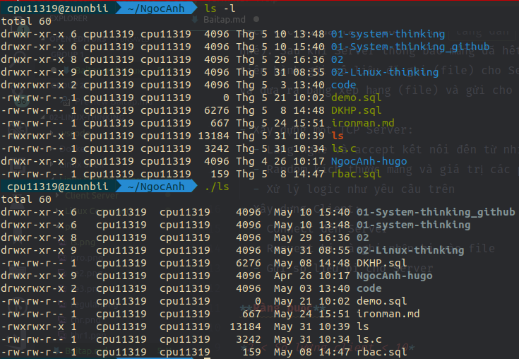
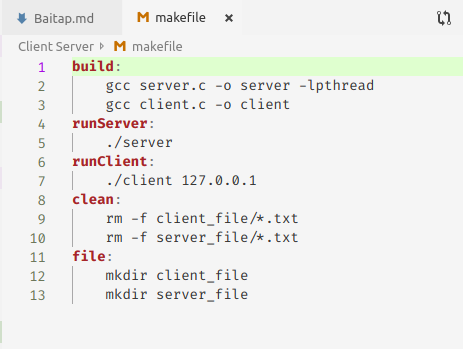
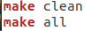

# Bài tập

## Yêu cầu bài tập

### 3.2. Linux Command

- Viết chương trình `C` mô phỏng lại command `ls -l`

### 3.3. Trò chơi xếp bi

**Mục tiêu**

- Biết cách xây dựng TCP Client, TCP Server
- Vận dụng các kiến thức về Linux System ở trên để giải quyết bài toán, cụ thể là về Networking, Thread, Synchronization,...
- Biết cách sử dụng các công cụ debug trong quá trình code.

**Mô tả**

- Vào mùa thu năm 2019, Bill và đồng bọn đã nghĩ ra một trò chơi hết sức kinh dị như sau: Cả bọn xây dựng một cửa hàng cung cấp bi với số lượng và chất lượng (kích thước) có giới hạn. Sau khi xây dựng xong cửa hàng, cả bọn tập trung tại một điểm và chạy đến cửa hàng để lấy ngẫu nhiên một bi về `tổ ` của từng thằng, sau đó sắp xếp theo kích thước tăng dần của các bi. Một thời gian sau, cửa hàng hết bi và cả bọn tìm ra người chiến thắng bằng cách gửi số liệu bi về cho bác bán hàng, bác bán hàng tiến hành tính tính toán toán và thông báo kẻ thắng cuộc.

**Yêu cầu**

- Xây dựng một chương trình (console) với hai thành phần Client (Bill và đồng bọn) và server (Cửa hàng và bác bán hàng). Khi Server start nó khởi tạo ngẫu nhiên một mảng các phần tử số nguyên, với kích thước mảng `ngẫu nhiên` trong khoảng từ 100-1000 phần tử. Các Client mở kết nối đến Server và tiến hành lấy một phần tử trong mảng và ghi vào một file `(tổ)`, file này chứa danh sách các số đã lấy theo thứ tự `tăng dần` (file này ở phía Client nhé). Sau khi Server thông báo mảng đã hết các phần tử, Client tiến hành gửi số liệu đã ghi (file) cho Server, Server tính toán và đưa ra bảng xếp hạng (file) và gửi cho tất cả Client.

- Xây dựng một TCP Server:
  - Lắng nghe và accept kết nối đến từ nhiều Client.
  - Random kích thước mảng và giá trị các phần tử trong mảng.
  - Xử lý logic như yêu cầu trên
- Xây dựng Client:
  - Connect đến Server
  - Request bi và ghi nhận bi vào file
  - Gửi số liệu bi cho Server

**Ràng buộc**

*2 < Số lượng client < 10*
*100 < Kích thước mảng < 1000*

## Ý tưởng

### 3.2

So sánh kết quả giữa lệnh ls -l với file thực thi ls



### 3.3

- Server:
  - Server yêu cầu nhập số client từ 3 - 9, sau đó mở số thread tương ứng cho số client, mỗi client 1 thread và đợi đến khi tất cả client đã kết nối.
  - Sau khi kết nối hoàn tất, server gửi mess "start", các client liên tục gửi mess là tên của client và nhận về giá trị của ball, sau đó sắp xếp và ghi vào file. Khi server gửi hết toàn bộ ball, server send giá trị "-1" và bắt đầu nhận mảng, ghi vào thư mục server_file với tên là tên của client và đuôi ".txt". Sau khi ghi đủ số file xuống, server tính toán và gửi rank cho mỗi client.
- Client
  - Yêu cầu kết nối tới server. Sau khi kết nối thành công, thực hiện gửi mess là tên của mình tới server và nhận lại ball. Sau khi nhận được giá trị là "-1", thực hiện sắp xếp lại mảng, ghi xuống file gửi mảng cho server và nhận lại thông báo rank.
- Make file
  - Cấu trúc make file:
  - 
  - Cú pháp gọi lệnh:
  - 
- Run:

```bash
make file
make build
make runServer
make runClient
```