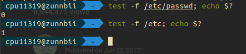
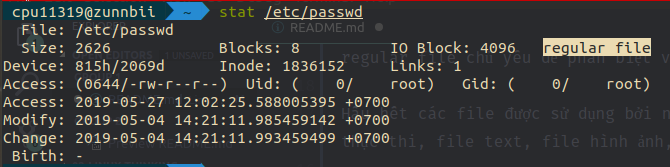
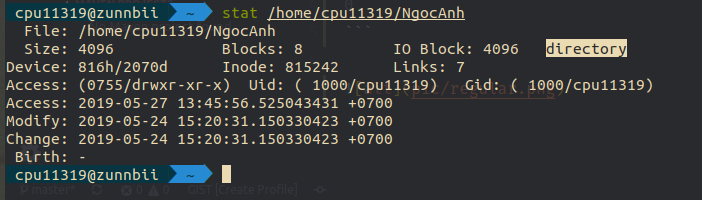
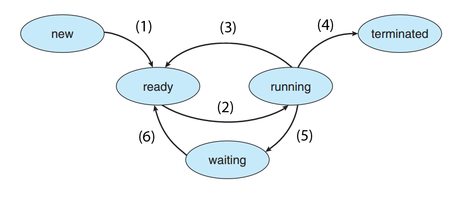

# KIẾN THỨC VỀ LINUX SYSTEM

## 1. FILE VÀ FILE SYSTEM

### 1.1. FILE DESCRIPTOR TRONG KERNEL

Nhân – hay kernel – là chương trình lõi để quản lý các tài nguyên CPU, bộ nhớ hệ thống, thiết bị hệ thống bao gồm các hệ thống file và kết nối mạng. Ngoài ra nó còn chịu trách nhiệm quản lý các tiến trình – hay các process.

Điều đó có nghĩa là khi bạn khởi động một ứng dụng, kernel sẽ tải ứng dụng đó vào trong bộ nhớ, tạo ra các tiến trình cần thiết và khởi động để ứng dụng chạy. Khi ứng dụng cần bộ nhớ, kernel sẽ phân bổ cho nó. Khi ứng dụng cần kết nối mạng, kernel sẽ làm tất cả các tác vụ xử lý bậc thấp.

Một cách giải thích đơn giản về file descriptor:

Khi người dùng mở một file, hệ điều hành sẽ tạo một entry đại diện cho file đó và lưu lại thông tin về file đã mở. Vậy nên nếu có 100 files đang mở trong hệ điều hành, sẽ có 100 entries được tạo ra. Entry được biểu diễn như một số nguyên dương. Số nguyên này chính là mô tả file (file descriptor).

Tóm lại, file descriptor là một số nguyên mô tả duy nhất một file đang mở trong hệ điều hành. Nó diễn tả data source và cách data sourse được truy cập.

### 1.2. REGULAR FILE

Regular file là loại file có thể được lưu trữ trong hệ thống file. Nó được gọi là regular file chủ yếu để phân biệt với các loại file đặc biệt khác.

Hầu hết các file được sử dụng bởi người dùng thực đều là các regular file. Các file thực thi, file text, file hình ảnh,... đều là regular file.

#### Các loại file trong Linux

Trong Linux kernel, các loại file được khai báo trong trong header file sys/stat.h

|Type name | Symbolic name | Bitmask   |
|----------|:-------------:|:---------:|
[Socket](https://www.computerhope.com/jargon/s/socket.htm)|S_IFSOCK|0140000
[Symbolic link](https://www.computerhope.com/jargon/s/symblink.htm)|S_IFLNK|0120000
Regular file|S_IFREG|0100000
[Block special file](https://www.computerhope.com/jargon/s/special-file.htm#block-special-file) |S_IFBLK|0060000
[Directory](https://www.computerhope.com/jargon/d/director.htm) |S_IFDIR|0040000
[Character device](https://www.computerhope.com/jargon/s/special-file.htm#character-special-file) |S_IFCHR|0020000
[FIFO (named pipe)](https://www.computerhope.com/jargon/f/fifo.htm)|S_IFIFO|0010000

#### Cách kiểm tra một file có là regular file hay không

* Trong bash, câu lệnh "test -f file" trả về kết quả là 0 nếu là regular file, trả về 1 nếu file thuộc loại khác hoặc không tồn tại.
* Ngoài ra, có thể check với lệnh [stat](https://www.computerhope.com/jargon/s/stat.htm).

```bash
test -f /etc/passwd; echo $?  # check for regular file, echo exit status of test
0
```







### 1.3. SPECIAL FILE

Trong hệ điều hành, special file là một loại file được lưu trữ trong hệ thống file. Special file có thể được gọi là device file.

The purpose of a special file is to expose the device as a file in the file system. A special file provides a universal interface for hardware devices (and virtual devices created and used by the kernel), because tools for file I/O can be used to access the device.

When data is red from or written to a special file, the operation happens immediately, and is not subject to conventional filesystem rules.

In Linux, there are two types of special files: block special files and character special files.

#### Block special files

A block special file acts as a direct interface to a block device. A block device is any device which performs data I/O in units of blocks.

Examples of block special files:

* /dev/sdxn — mounted partitions of physical storage devices. The letter x refers to a physical device, and the number n refers to a partition on that device. For instance, /dev/sda1 is the first partition on the first physical storage device.
* /dev/loopn — loop devices. These are special devices which allow a file in the filesystem to be used as a block device. The file may contain an entire filesystem of its own, and be accessed as if it were a mounted partition on a physical storage device. For example, an ISO disk image file may be mounted as a loop device.

If you want to know how big a block is on your system, run "blockdev --getbsz device" as root, e.g.:

```bash
sudo blockdev --getbsz /dev/sda1
4096
```

In this example, the block size is 4096 bytes (4 kibibytes).

#### Character special files

A character special file is similar to a block device, but data is written one character (eight bits, or one byte) at a time.

Examples of character special files:

* /dev/stdin (Standard input.)
* /dev/stdout (Standard output.)
* /dev/stderr (Standard error.)
* /dev/random (PRNG which may delay returning a value to acquire additional entropy.)
* /dev/urandom (PRNG which always returns a value immediately, regardless of required entropy.)
* /dev/null (The null device. Reading from this file always gets a null byte; writing to this file successfully does nothing.)

#### How can I tell if a file is special

* Test for block special
  * In bash, the command "test -b file" returns an exit status of 0 if file is block special, or 1 if file is of another type or does not exist.
* Test for character special
  * To determine if a file is character special, use "test -c file":
* Using stat

## 2. PROCESS & THREAD

### 2.1. PROCESS

#### a. ĐỊNH NGHĨA

Những “công việc” mà hệ điều hành thực hiện gọi là quá trình, dù tên gọi chúng khác nhau tùy vào cấu trúc hệ điều hành (batch system hay time-shared system).

Nhắc lại về định nghĩa, một process là một chương trình đang được thực thi (đang chạy). Nhưng, một chương trình không phải là một process. Vì chương trình là một file, hay một folder bị động nằm trên máy; Trong khi đó, một process là một chương trình đang hoạt động (đang chạy, đã được tải lên bộ nhớ chính để hoạt động).

Một chương trình có thể có hai (hay nhiều) process đang chạy, nhưng chúng được coi là hai (hay nhiều) quá trình độc lập với nhau.

Hơn những thế, một process có thể là môi trường thực thi (execution environment) cho những dòng code khác. Ví dụ: các chương trình của Java cần được chạy trong Java Virtual Machine (JVM).

#### b. CÁC TRẠNG THÁI CỦA MỘT PROCESS



* New: process mới được tạo.
* Running: process đang được thực thi/ chạy.
* Waiting: process đợi I/O hoặc tín hiệu nào đó.
* Ready: process sẵn sàng được CPU chạy.
* Terminated: process hoàn thành việc.
* **Note:** Những process của một chương trình cần phải tải lên bộ nhớ chính (cụ thể là RAM) trước khi được CPU nhận và thực hiện những yêu cầu của chương trình.

Các bước chuyển quá trình của process:

(1): Những process được chương trình tạo ra, được sắp vào “hàng chờ” (hay còn gọi là stack).

(2): Process được CPU thấy và thực thi.

(3): Khi process quá bự, CPU phải nhả để thực hiện process khác. (bạn có thể tìm hiểu các thuật toán xử lý process của CPU)

(4): Khi process đã được thực hiện xong.

(5): Khi process đang thực hiện và yêu cầu I/O hay các tín hiệu khác. (ví dụ bạn cần file word in ra, process sẽ phải nói cho CPU, CPU gửi tín hiệu cho máy in, máy in in ra rồi báo lại CPU. Trong thời gian đó, để tiết kiệm thời gian, process này sẽ được chuyển qua trạng thái chờ, cho process khác vào thực hiện)

(6): Sau khi I/O hay tín hiệu đã đến, process được sắp lại vào “hàng chờ”, chờ thực thi.

#### c. PROCESS CONTROL BLOCK (PCB)

Mỗi process khi tạo ra sẽ được lưu thông tin tại một PCB tương ứng.

Những thông tin được chứa trong PCB:

1. Trạng thái của process: 1 trong 5 trạng thái được liệt kê bên trên.
2. Bộ đếm (program counter): chứa địa chỉ (hay trong ngôn ngữ lập trình C, ta gọi nó là con trỏ/ pointer) đến lệnh cần thực thi tiếp theo.
3. Thanh ghi CPU: có kiểu khác nhau tùy vào kiến trúc máy tính.
4. Thông tin định thời CPU: độ ưu tiên của các process, quy định process nào thì thực thi trước.
5. Thông tin quản lý bộ nhớ: tùy hệ thống bộ nhớ của từng hệ điều hành.
6. Trạng thái của các tín hiệu I/O: danh sách các I/O được sử dụng bởi các process.
7. Thông tin về số lượng CPU, thời gian sử dụng thực tế, thời gian process được giữ CPU tối đa.
8. Đã nhắc đến quá trình (process), bạn nên tìm hiểu thêm về định thời, khả năng CPU của chúng ta kiểm soát các process ấy tại bài viết về bộ định thời.

#### d. THÀNH PHẦN CỦA MEMORY LAYOUT

Cấu trúc cơ bản của một chương trình C đang chạy trong bộ nhớ(memory) gồm các phần sau:

* *Text segment(code segment)*

Text segment(.text segment) hay còn gọi là Code segment là phần bộ nhớ chứa code đã được compile của chương trình, vùng nhớ này thường là read-only. Phần text segment này lấy từ text segment trong file thực thi excutable object.

Thông thường text segment là sharable memory, nó chỉ tồn tại duy nhất một bản copy trên physic memory dùng chung cho tất cả các instance của chương trình. Ví dụ như chương trình soạn thảo văn bản, có thể mở nhiều instance cùng lúc, nhiều process được tạo ra, nhưng chỉ là trên địa chỉ ảo(virtual address) của process, còn thực tế thì chỉ có một bản copy duy nhất trên physic memory.

* *Initialized data(data segment)*

Initialized data segment (.data hay còn gọi là Data segment) là vùng nhớ này chứa các biến global, static hoặc extern được khởi tạo trực tiếp trong code bởi lập trình viên(hard-code). Vùng nhớ này có thể được chia làm 2 loại: read-only và read-write. Và có thể một số cấu trúc chia segment này ra thành 2 segment: .data(initialized data) và .rdata(read-only initialized data).

Ví dụ:

```c
1 char  s1[]  = "Hello world";
2 char* s2    = "Hello world";
3 s1[0] = 'A';  //Not error
4 s2[0] = 'A';  //ERROR
```

* s1 là non-const array, nghĩa là một mảng chứa 12 character bao gồm cả \0 ở cuối được khởi tạo trong vùng nhớ read-write. Vì s1 là mảng nên địa chỉ của s1 với địa chỉ phần tử đầu tiên của s1 là như nhau(xuất log %p của s1 hay của &s1 đều như nhau). Data của s1 nằm trong vùng nhớ read-write nên được phép thay đổi giá trị.
* s2 là non-const pointer to const data, nghĩa là con trỏ trỏ tới một vùng data(trỏ tới character đầu tiên) và vùng data này nằm trong vùng read-only. s2 chỉ là con trỏ nên địa chỉ của s2 khác với địa chỉ của &s2(&s2 là lấy địa chỉ của địa chỉ hay con trỏ cấp 2). Data của s2 nằm trong vùng nhớ read-only nên không thể thay đổi giá trị.
* Cả 2 data này đều không thể thay đổi kích thước, chỉ có data trên stack và heap là thay đổi được kích thước.

```c
1 char  s1[]  = "Hello world";
2 char* s2    = "Hello world";
3 s1[]  = "Hello world 2";   //ERROR
4 s2    = "Hello world 2";   /*Trỏ con trỏ sang vùng nhớ khác chứ không phải thay đổi data ở vùng nhớ cũ*/
```

* *Uninitialize data(bss segment)*

Uninitialized data segment (.bss hay còn gọi là BSS segment) là vùng nhớ chứa các biến global, static hoặc extern chưa được khởi tạo trong code và sẽ được khởi tạo bằng 0 khi chương trình bắt đầu thực thi. Các biến này không chiếm bộ nhớ trên object file, mà nó chỉ là một place holder.

* *Heap*

Stack là vùng nhớ được dùng để chứa các biến local, các biến được truyền đi(passing argument) khi thực thi một hàm và địa chỉ của giá trị trả về sau khi thực thi hàm. Các biến local chỉ tồn tại trong một block code mà nó được định nghĩa, khi ra khỏi block các biến này sẽ được xóa khỏi stack. Các giá trị được thêm vào stack theo nguyên tắc LIFO theo hướng từ địa chỉ cao xuống đia chỉ thấp(trên kiến trúc x86, có thể theo chiều ngược lại ở một số kiến trúc khác).
Thanh nhớ stack pointer sẽ ghi nhớ lại đỉnh của stack mổi khi có giá trị thêm vào. Khi một bộ các giá trị được đẩy vào để thực thi một hàm ta gọi là một stack frame. Một stack frame có ít nhất một địa chỉ trả vể(chứa địa chỉ của giá trị trả về sau khi gọi hàm). Tất cả các hàm gọi lồng nhau được thêm vào stack thành nhiều stack frame. [Xem cách hàm được thực thi](http://hoangminh1789.blogspot.com/2015/05/function-in-cpp.html).

* *Stack*

Heap là vùng nhớ được cấp phát động bởi các lênh malloc, realloc và free. Vùng nhớ heap được cấp phát mở rộng từ vùng nhớ thấp đến vùng nhớ cao(ngược lại với stack). Stack và heap mở rộng đến khi "đụng" nhau là lúc bộ nhớ cạn kiệt. Vùng nhớ heap là vùng nhớ share giữa các tất cả các shared library và dynamic library được load trong process(tiến trình).

*Vùng nhớ của một tiến trình được quản lý bằng địa chỉ ảo(virtual address) nên sẽ liên tục nhau, nhưng thực tế sẽ được ánh xạ không liên tục trên RAM.*

### 2.2. THREAD

#### a. KHÁI NIỆM VỀ THREAD

Thread là một cơ chế cho phép một ứng dụng thực thi đồng thời nhiều công việc (multi-task). Ví dụ một trường hợp đòi hỏi multi-task sau: một tiến trình web server của một trang web giải trí phải phục vụ hàng trăm hoặc hàng nghìn client cùng một lúc. Công việc đầu tiên của tiến trình là lắng nghe xem có client nào yêu cầu dịch vụ không. Giả sử có client A kết nối yêu cầu nghe một bài nhạc, server phải xử lý chạy bài hát client A yêu cầu; nếu trong lúc đó client B kết nối yêu cầu tải một bức ảnh thì server lúc đó không thể phục vụ vì đang bận phục vụ client A. Đây chính là kịch bản yêu cầu một tiến trình cần thực thi multi-task. Qua các bài học về process, ta thấy tiến trình server nói trên có thể giải quyết bài toán này như sau: Server chỉ làm công việc chính là lắng nghe xem có client nào yêu cầu dịch vụ không; khi tiến trình A kết nối, server dùng system call fork() để tạo ra một tiến trình con chỉ làm công việc client A yêu cầu, trong khi nó lại tiếp tục lắng nghe các yêu cầu từ các client khác. Tương tự, khi client B kết nối, server lại tạo ra một tiến trình con khác phục vụ yêu cầu của client B. Trong bài học này, chúng ta sẽ thấy việc xử lý đa tác vụ của server như trên có thể dùng thread. Thậm chí trong trường hợp này thread còn tỏ ra thích hợp hơn so với việc sử dụng tiến trình con như đã giải thích ở trên, chúng ta sẽ tìm hiểu rõ hơn trong bài này.

Thread là một thành phần của tiến trình, một tiến trình có thể chứa một hoặc nhiều thread. Hệ điều hành Unix quan niệm rằng mỗi tiến trình khi bắt đầu chạy luôn có một thread chính (main thread); nếu không có thread nào được tạo thêm thì tiến trình đó được gọi là đơn luồng (single-thread), ngược lại nếu có thêm thread thì được gọi là đa luồng (multi-thread). Các thread trong tiến trình chia sẻ các vùng nhớ toàn cục (global memory) của tiến trình bao gồm initialized data, uninitialized data và vùng nhớ heap. Nếu các bạn chưa nắm rõ các segment của tiến trình thì có thể xem lại trong bài học "Khái quát về tiến trình" ở đây

Hình vẽ dưới đây mô tả về một tiến trình đơn luồng (single-thread) và đa luồng (multi-thread):

<p align="center">
  
  <br/>
</p>

Trong hình vẽ trên, một tiến trình có 4 thread, bao gồm 1 main thread (T0) được tạo ra khi tiến trình chạy hàm main(), và 3 thread lần lượt là T1, T2 và T3 được tạo mới trong hàm main(). Bốn thread sử dụng chung vùng nhớ toàn cục (global memory) nhưng mỗi thread có phân vùng stack riêng của mình, cụ thể như hình vẽ dưới đây:

<p align="center">
  
  <br/>
</p>

Các thread trong tiến trình có thể thực thi đồng thời và độc lập với nhau. Nghĩa là nếu một thread bị block do đang chờ I/O thì các thread khác vẫn được lập lịch và thực thi thay vì cả tiến trình bị block.

#### b. POSIX THREAD

Quay lại thời điểm sơ khai của thread, khi đó mỗi nhà cung cấp phần cứng triển khai thread và cung cấp các API để lập trình thread của riêng mình. Điều này gây khó khăn cho các developer khi phải học nhiều phiên bản thread và viết 1 chương trình thread chạy đa nền tảng phần cứng. Trước nhu cầu xây dựng một giao diện lập trình thread chung, tiêu chuẩn POSIX Thread (pthread) cung cấp các giao diện lập trình thread trên ngôn ngữ C/C++ đã ra đời.

* Pthread data type
  * Trước khi bắt tay vào khám phá các API của pthread, chúng ta cần lướt qua một số kiểu dữ liệu pthread định nghĩa riêng dưới đây:
  
|Kiểu dữ liệu|Mô tả|
|----------|:-------------|
pthread_t|Số định danh của thread (threadID)
pthread_mutex_t|Mutex
pthread_mutexattr_t|Thuộc tính của mutex
pthread_cond_t|Biến điều kiện
pthread_condattr_t|Thuộc tính của biến điều kiện
pthread_key_t|Khóa cho dữ liệu của thread
pthread_attr_t|Thuộc tính của thread

#### c. API TRONG POSIX

Về mặt kỹ thuật, API là viết tắt của Giao diện lập trình ứng dụng (Application Programming Interface).

API là một trung gian phần mềm cho phép hai ứng dụng giao tiếp với nhau.

API có thể sử dụng cho web-based system, operating system, database system, computer hardware, or software library.

API specification có thể có nhiều dạng, nhưng thường bao gồm các đặc tả cho routines, data structures, object classes, variables, or remote calls. POSIX, API Windows và ASPI là những ví dụ về các dạng API khác nhau. Tài liệu cho API thường được cung cấp để tạo thuận lợi cho việc sử dụng và triển khai.

Hầu hết các công ty lớn đã xây dựng API cho khách hàng của họ hoặc để sử dụng nội bộ.

    Ví dụ API thực tế:
    Bạn truy cập vào trang web của hãng hàng không để kiểm tra địa điểm, thời gian bay, giá cả,…
    Tuy nhiên, điều gì sẽ xảy ra nếu bạn không sử dụng trang web của hãng hàng không, mà lại sử dụng một dịch vụ du lịch trực tuyến, như Traveloka hoặc Expedia.
    Trong trường hợp này, dịch vụ du lịch tương tác với API của hãng hàng không, yêu cầu lấy thông tin từ cơ sở dữ liệu của hãng như chỗ ngồi, tùy chọn hành lý, giá cả v.v. sau đó hiển thị cho bạn thông tin cập nhật nhất.

#### d. MULTI-THREAD

Về cơ bản Multi Thread là một khả năng của một nền tảng (hệ điều hành, máy ảo vv) hoặc các ứng dụng để tạo ra một quá trình bao gồm nhiều Thread được thực thi. Một Thread thực hiện là chuỗi nhỏ nhất của hướng dẫn lập trình có thể được quản lý một cách độc lập bởi một lscheduler . Những Thread có thể chạy song song và nó có thể làm tăng hiệu quả của chương trình.

Trong các hệ thống đa lõi và đa xử lý thì đa luồng tức là các thread được thực hiện cùng lúc trên lõi hoặc bộ vi xử lý khác nhau.

Đối với hệ thống lõi đơn thì đa luồng chia thời gian giữa các thread. System sẽ gửi 1 số lượng nhất định các hướng dẫn từ mỗi Thread để xử lý. Các Thread không được thực hiện đồng thời. System chỉ mô phỏng thực hiện đồng thời của chúng. Tính năng này của System được gọi là đa luồng.

Multithreading được sử dụng khi thực hiện song song 1 số nhiệm vụ dẫn đến việc tận dụng hiệu quả hơn các tài nguyên của hệ thống.

#### e. RACING CONDITION & DEADLOCK

Có 2 vấn đề thường gặp với thread đó là **racing condition** và **deadlock*.

Đầu tiên là ****The Race****. Ta có ví dụ sau:

```c
class Program
    {
        // shared memory variable between the two threads
        // used to indicate which thread we are in
        private static string _threadOutput = "";

        /// <summary>
        /// Thread 1: Loop continuously,
        /// Thread 1: Displays that we are in thread 1
        /// </summary>
        static void DisplayThread1()
        {
            while (true)
            {
                Console.WriteLine("Display Thread 1");

                // Assign the shared memory to a message about thread #1
                _threadOutput = "Hello Thread1";


                Thread.Sleep(1000);  // simulate a lot of processing

                // tell the user what thread we are in thread #1, and display shared memory
                Console.WriteLine("Thread 1 Output --> {0}", _threadOutput);

            }
        }


        /// <summary>
        /// Thread 2: Loop continuously,
        /// Thread 2: Displays that we are in thread 2
        /// </summary>
        static void DisplayThread2()
        {
            while (true)
            {
                Console.WriteLine("Display Thread 2");


                // Assign the shared memory to a message about thread #2
                _threadOutput = "Hello Thread2";


                Thread.Sleep(1000);  // simulate a lot of processing

                // tell the user we are in thread #2
                Console.WriteLine("Thread 2 Output --> {0}", _threadOutput);

            }
        }
        public static void Main()
        {
            // construct two threads for our demonstration;
            Thread thread1 = new Thread(new ThreadStart(DisplayThread1));
            Thread thread2 = new Thread(new ThreadStart(DisplayThread2));

            // start them
            thread1.Start();
            thread2.Start();
        }
    }
```

Nếu như không sử dụng đến thread thì ta sẽ chỉ có 2 dạng output đó là **“Thread 1 Output --> Hello Thread1”** và **“Thread 2 Output --> Hello Thread2”**. Nhưng thực tế khi chạy đoạn mã trên tra được kết quả  có thể là **“Thread 1 Output --> Hello Thread2”** và **“Thread 2 Output --> Hello Thread1”**.

<p align="center">
  
  <br/>
</p>

**Lý do dẫn đến hiện tượng này?**

Đó là vì 2 thread cùng chia sẻ tài nguyên, trong trường hợp này là biến **threadOutput**. Cụ thể hơn như sau, khi thread 1 chạy và gán giá trị cho biến **threadOutput** là hello thread 1. Nếu như thread 1 tiếp tục thực hiện lệnh tiếp theo thì sẽ không có gì đáng nói. Kết quả vẫn là **“thread 1 output là hello thread 1”**. Nhưng trong lúc đó thread 2 cũng đang chạy. Và 1 cách tình cờ là trước khi thread 1 kịp xuất giá trị ra output thì thread 2 đã gán giá trị khác cho biến **threadOutput**. Do đó đến khi thread 1 chạy lệnh xuất ra output thì ta thu được kết quả **“thread1 output -> hello thread 1”**. Ta gọi trường hợp này là **racing condition**. 2 thread 1 và 2 chạy đua với nhau trong việc gán giá trị và lấy giá trị từ cùng 1 biến. **The race** là cơn ác mộng lớn nhất đối với programmer. Bởi vì nó diễn ra không theo quy luật nào cả, rất khó để tái hiện, không thể debug. Ví dụ trên là ví dụ ta khởi tạo 2 thread khác nhau với cùng truy cập vào 1 biến. Câu hỏi đặt ra là cùng 1 thread nhưng được tạo ra 2 lần thì liệu có xảy ra hiện tượng trên ko? Câu trả lời là có. Xem thêm ví dụ trong code. Cho nên hiện tượng **The Race** này có thể xảy ra đối với mọi chỗ ta sử dụng thread. Suy ra nên nhắc lại lần nữa cực kỳ, cực kỳ cẩn trọng khi sử dụng thread.

Vậy làm cách nào để tránh hiện tượng **The Race**?

Cách tốt nhất để tránh hiện tượng Race là viết thread-safe code. Các quy tắc đó là

Share memory một cách ít nhất có thể. Mỗi 1 instance của class là thread-safe. Vì khi tạo 1 instance mới của clas, hệ thống sẽ cấp phát cho instance đó 1 vùng nhớ riêng, không sử dụng chung với các instance khác. Do đó khi thread truy cập đến vùng nhớ của instance thì sẽ không sợ bị thread khác can thiệp vào giữa. Điều này chỉ đúng đối với các biến ko phải là biến tĩnh  static với C# và shared với VB. Các biến tĩnh được share giữa các instance với nhau. Để các thread sử dụng chung biến tĩnh với nhau ta phải có một cách để đảm bảo các thread khác không được quyền truy cập vào vùng biến tĩnh này nếu như ta đang dùng. Các này người ta gọi là locking. Trong C# ta có thể thực hiện locking với Mornitor class hay lock{} construct. Sửa lại ví dụ trên như sau:

```c
/// <summary>
/// Thread 1, Displays that we are in thread 1 (locked)
/// </summary>
void DisplayThread1()
{
    while (_stopThreads == false)
    {
        // lock on the current instance of the class for thread #1
        lock (this)
        {
            Console.WriteLine("Display Thread 1");
            _threadOutput = "Hello Thread1";
            Thread.Sleep(1000);  // simulate a lot of processing
                                 // tell the user what thread we are in thread #1
            Console.WriteLine("Thread 1 Output --> {0}", _threadOutput);
        } // lock released  for thread #1 here
    }
}
```

Như ta thấy với cách sửa này thì vấn đề trên đã được giải quyết

**Tại sao không thêm lock cho tất cả các method trong thread?**

Việc thêm lock có thể giải quyết được vấn đề **Racing Condition**, vậy tại sao ta ko thêm lock cho tất cả các thread để chắc chắn rằng ko bao giờ có hiện tượng **Racing Condition**. Câu trả lời là không, trước hết việc 1 thread này chờ thread khác thực hiện sẽ làm giảm tốc độ thực hiện. Nếu như tất cả các thread đều có lock thì ta dễ quay trở lại làm việc như có 1 thread. Mà lại còn chậm hơn vì phải thêm cơ chế quản lý các thread sinh ra, quản lý lock, check lock. Nhưng đó vẫn chưa phải là vấn đề lớn nhất. Thử tưởng tượng rằng có 2 thread, trong đó thread #1 đang đợi lock được mở bởi thread #2 và thread #2 cũng lại đợi lock được mở bởi thread #1. Việc này sẽ dẫn đến 2 thread này đều không hoạt động vô thời hạn và chương trình bị treo. Trạng thái này được gọi là *DeadLock*.

DeadLook xét về mặt nào đấy còn nguy hiểm hơn cả **Racing condition** vì nếu rơi vào trạng thái dead lock chương trình sẽ dừng hoàn toàn. Và nó cũng rất khó để cho programmer để debug và fix lỗi.

Ví dụ về *deadlock*

```c
public class Akshay
    {
        static readonly object firstLock = new object();
        static readonly object secondLock = new object();
        static void Thread1()
        {
            Console.WriteLine("\t\t\t\tThread 1: waiting firstLock");
            lock (firstLock)
            {
                Console.WriteLine("\t\t\t\tThread1 Locked firstLock");
                // Wait until we're fairly sure the first thread
                // has grabbed secondLock
                Thread.Sleep(1000);
                Console.WriteLine("\t\t\t\tThread 1 waiting secondLock");
                lock (secondLock)
                {
                    Console.WriteLine("\t\t\t\tThread 1 Locked secondLock");
                }
                Console.WriteLine("\t\t\t\tThread 1 Released secondLock");
            }
            Console.WriteLine("\t\t\t\tThread 1 Released firstLock");
        }
        static void Main()
        {
            new Thread(new ThreadStart(Thread1)).Start();
            // Wait until we're fairly sure the other thread
            // has grabbed firstLock
            Thread.Sleep(500);
            Console.WriteLine("Thread main waiting secondLock");
            lock (secondLock)
            {
                Console.WriteLine("Thread main Locked secondLock");
                Console.WriteLine("Thread main waiting firstLock");
                lock (firstLock)
                {
                    Console.WriteLine("Thread main Locked firstLock");
                }
                Console.WriteLine("Thread main Released firstLock");
            }
            Console.WriteLine("Thread main Released secondLock");
            Console.Read();
        }
    }
```

<p align="center">
  
  <br/>
</p>

Như ta thấy trong ví dụ trên có 2 thread là thread1 và thread main. “Thread main” chờ “thread 1” unlock khóa **“firstlock”** trong khi “thread1” lại chờ “thread main” unlock khóa **“secondlock”**. Dẫn đến chương trình bị dừng vô thời hạn.

Vấn đề này sinh ra khi chúng ta sử dụng 1 khóa static là **“firstlock”** và **“secondlock”**. Do đó để fix ta có thể đơn giản là mỗi thread sử dụng 1 khóa khác nhau. Việc đó là đúng nếu như các thread không truy cập đến cùng 1 vùng nhớ( như đọc và ghi vào chung 1 biến chẳng hạn…). Vì nếu các thread truy cập đến cùng 1 vùng nhớ mà ta sử dụng khóa khác nhau thì sẽ dễ quay lại hiện tượng Racing. Do đó cần hiểu object lock (object nằm trong câu lệnh lock()) sẽ đại diện cho vùng data mà nó khóa. Các thread truy cập đến cùng 1 vùng data phải có chung 1 object lock và truy cập đến các data khác nhau nên có những object lock khác nhau

## 3. SYNCHRONIZATION

### 3.1. SEMAPHORE

Semaphore là một biến được bảo vệ (hay là một kiểu dữ liệu trừu tượng), tạo thành một phương pháp để hạn chế truy nhập tới tài nguyên dùng chung trong môi trường đa lập trình (multiprogramming). Đây là một phát minh của Edsger Dijkstra và được sử dụng lần đâu tiên trong hệ điều hành THE.

Giá trị của semaphore được khởi tạo bằng số các tài nguyên tương đương được chia sẻ cái mà cài đặt điều khiển. Trong trường hợp đặc biệt, khi mà chỉ có một tài nguyên tương đương được chia sẻ, semaphore được gọi là semaphore nhị phân. Trong trường hợp khái quát, semaphore thường được gọi là biến đếm semaphore.

Semaphore là lời giải kinh điển cho bài toán bữa tối của các triết gia (dining philosophers), mặc dù nó không ngăn được hết các deadlock.

Semaphore chỉ có thể được truy nhập bằng cách sử dụng các toán tử sau

```c
P(Semaphore s)
{
  chờ cho đến khi s > 0, rồi s := s-1;
  /* phải là toán tử nguyên tố (không bị chia cắt) một khi phát hiện được s > 0 */
}

V(Semaphore s)
{
  s := s+1;   /* phải là toán tử nguyên tố */
}

Init(Semaphore s, Integer v)
{
  s := v;
}
```

Semaphores còn được sử dụng phổ biến trong các ngôn ngữ lập trình - những ngôn ngữ mà về bản chất không hỗ trợ những dạng khác của sự đồng bộ hóa. Chúng cũng được sử dụng trong các kĩ thuật đồng bộ ban đầu như trong các hệ điều hành. Xu hướng trong sự phát triển của ngôn ngữ lập trình, dường như là hướng vào các dạng cấu trúc đồng bộ hóa, giống như đồng bộ hóa các kênh. Cộng thêm sự không đầy đủ trong cách phân chia với deadlock, semaphore không bảo vệ người lập trình khỏi các lỗi đơn giản trong việc lấy một semaphore - cái mà luôn luôn được thay đổi bởi các tiến trình đồng thời, và cũng quên giải phóng semaphore sau khi lấy ra.

### 3.2. MUTEX

Khi một ứng dụng máy tính được khởi động, nó sẽ tạo ra một mutex và gắn nó vào một tài nguyên. Khi tài nguyên được sử dụng bởi một chủ đề, nó bị khóa và chủ đề khác không thể sử dụng nó. Nếu một thread khác muốn sử dụng cùng một tài nguyên, nó sẽ phải làm một yêu cầu. Sau đó thread đó sẽ được đặt trong một hàng đợi cho đến khi chủ đề đầu tiên kết thúc với tài nguyên. Khi chủ đề đầu tiên kết thúc với tài nguyên, khóa sẽ được gỡ bỏ và chủ đề đợi trong hàng đợi có thể truy cập vào tài nguyên. Nếu có nhiều luồng chờ đợi trong hàng đợi, chúng sẽ được truy cập một cách luân phiên. Thực tế, khi mutex thay thế quyền truy cập vào một tài nguyên giữa nhiều luồng, nó sẽ được hiển thị như nhiều chủ đề đang tiêu thụ một nguồn lực cùng một lúc. Nhưng nội bộ chỉ có một sợi duy nhất đang truy cập vào tài nguyên tại một thời điểm nhất định.

### 3.3. PHÂN BIỆT MUTEX VÀ SEMAPHORE

Mặc dù cả hai semaphores và mutex đối tượng được sử dụng để đạt được lẫn nhau trong môi trường lập trình song song, họ có một số khác biệt. Một đối tượng mutex chỉ cho phép một luồng duy nhất sử dụng một tài nguyên hoặc một phần quan trọng, trong khi semaphores cho phép một số lượng hạn chế truy cập đồng thời vào một tài nguyên (dưới một số cho phép tối đa).Với các đối tượng mutex, các chủ đề khác muốn truy cập tài nguyên phải đợi trong hàng đợi, cho đến khi chủ đề hiện tại kết thúc bằng cách sử dụng tài nguyên.

### 3.4. READERS - WRITERS PROBLEM

The readers-writers problem relates to an object such as a file that is shared between multiple processes. Some of these processes are readers i.e. they only want to read the data from the object and some of the processes are writers i.e. they want to write into the object.

The readers-writers problem is used to manage synchronization so that there are no problems with the object data. For example - If two readers access the object at the same time there is no problem. However if two writers or a reader and writer access the object at the same time, there may be problems.

To solve this situation, a writer should get exclusive access to an object i.e. when a writer is accessing the object, no reader or writer may access it. However, multiple readers can access the object at the same time.

This can be implemented using semaphores. The codes for the reader and writer process in the reader-writer problem are given as follows:

#### Reader Process

The code that defines the reader process is given below:

```scala
wait (mutex);
rc ++;
if (rc == 1)
wait (wrt);
signal(mutex);
.
.  READ THE OBJECT
.
wait(mutex);
rc --;
if (rc == 0)
signal (wrt);
signal(mutex);
```

In the above code, mutex and wrt are semaphores that are initialized to 1. Also, rc is a variable that is initialized to 0. The mutex semaphore ensures mutual exclusion and wrt handles the writing mechanism and is common to the reader and writer process code.

The variable rc denotes the number of readers accessing the object. As soon as rc becomes 1, wait operation is used on wrt. This means that a writer cannot access the object anymore. After the read operation is done, rc is decremented. When re becomes 0, signal operation is used on wrt. So a writer can access the object now.

#### Writer Process

The code that defines the writer process is given below:

```scala
wait(wrt);
.
.  WRITE INTO THE OBJECT
.
signal(wrt);
```

If a writer wants to access the object, wait operation is performed on wrt. After that no other writer can access the object. When a writer is done writing into the object, signal operation is performed on wrt.

## 4. NETWORKING

### 4.1. TCP & UDP

TCP/IP là một bộ các cổng được thiết bị sử dụng để giao tiếp qua Internet và hầu hết các mạng cục bộ. Nó được đặt tên theo hai giao thức ban đầu của nó - Transmission Control Protocol (TCP) và Internet Protocol (IP). TCP cung cấp cho các ứng dụng cách để chuyển (và nhận) một luồng gói thông tin đã được đặt hàng và kiểm tra lỗi qua mạng. Giao thức User Datagram Protocol (UDP) được các ứng dụng sử dụng để vận chuyển một luồng dữ liệu nhanh hơn bằng cách bỏ qua kiểm tra lỗi. Khi cấu hình phần cứng hoặc phần mềm mạng bạn sẽ thấy sự khác biệt.

### 4.2. CÁCH THỨC HOẠT ĐỘNG CỦA TCP

TCP là giao thức được sử dụng phổ biến nhất trên Internet. Khi bạn yêu cầu một trang web trong trình duyệt, máy tính sẽ gửi các gói tin TCP đến địa chỉ của máy chủ web, yêu cầu nó gửi lại trang web. Máy chủ web phản hồi bằng cách gửi một luồng các gói tin TCP, mà trình duyệt web của bạn kết hợp với nhau để tạo thành trang web. Khi click vào liên kết, đăng nhập, đăng nhận xét hoặc làm bất kỳ điều gì khác, trình duyệt web của bạn sẽ gửi gói tin TCP tới máy chủ và máy chủ gửi lại các gói tin cho TCP.

Giao thức TCP có độ tin cậy cao, các gói tin được gửi bằng TCP sẽ được theo dõi do vậy dữ liệu sẽ không bị mất hoặc hỏng trong quá trình vận chuyển. Đó là lý do tại sao file tải xuống không bị hỏng ngay cả khi mạng có vấn đề. Tất nhiên, nếu bên nhận hoàn toàn ngoại tuyến, máy tính của bạn sẽ từ bỏ và bạn sẽ thấy một thông báo lỗi ghi nó không thể giao tiếp với máy chủ lưu trữ từ xa.

Giao thức TCP đạt được điều này theo hai cách. Đầu tiên, nó yêu cầu các gói tin bằng cách đánh số chúng. Thứ hai, nó kiểm tra lỗi bằng cách yêu cầu bên nhận gửi phản hồi đã nhận được cho bên gửi. Nếu bên gửi không nhận được phản hồi đúng, nó có thể gửi lại gói tin để đảm bảo bên nhận nhận chúng một cách chính xác.

Process Explorer và các tiện ích hệ thống khác có thể hiển thị loại kết nối mà tiến trình tạo ra. Ở đây chúng ta có thể thấy trình duyệt Chrome với các kết nối TCP mở tới nhiều máy chủ web khác nhau.

<p align="center">
  
  <br/>
</p>

### 4.3. CÁCH THỨC HOẠT ĐỘNG CỦA UDP

Giao thức UDP hoạt động tương tự như TCP, nhưng nó bỏ qua quá trình kiểm tra lỗi. Khi một ứng dụng sử dụng giao thức UDP, các gói tin được gửi cho bên nhận và bên gửi không phải chờ để đảm bảo bên nhận đã nhận được gói tin, do đó nó lại tiếp tục gửi gói tin tiếp theo. Nếu bên nhận bỏ lỡ một vài gói tin UDP, họ sẽ mất vì bên gửi không gửi lại chúng. Do đó thiết bị có thể giao tiếp nhanh hơn.

UDP được sử dụng khi tốc độ nhanh và không cần thiết sửa lỗi. Ví dụ, UDP thường được sử dụng cho các chương trình phát sóng trực tiếp và game online.

Giả dụ, bạn đang xem phát video trực tiếp, thường được phát bằng UDP thay vì TCP. Máy chủ sẽ gửi một luồng liên tục các gói tin UDP tới máy tính đang xem. Nếu bạn mất kết nối trong vài giây, video sẽ bị dừng hoặc bị giật trong giây lát và sau đó chuyển sang bit hiện tại của chương trình phát sóng. Nếu bạn chỉ bị mất gói tin nhỏ, video hoặc âm thanh có thể bị méo trong giây lát vì video sẽ tiếp tục phát mà không có dữ liệu bị thiếu.

Điều này hoạt động tương tự trong các trò chơi trực tuyến. Nếu bạn bỏ lỡ một số gói tin UDP, nhân vật người chơi có thể dịch chuyển trên bản đồ khi bạn nhận gói tin UDP mới. Việc bỏ qua sửa lỗi của TCP sẽ giúp tăng tốc kết nối trò chơi và giảm độ trễ.

<p align="center">
  
  <br/>
</p>

### 4.4. ĐIỂM GIỐNG NHAU GIỮA TCP & UDP

TCP và UDP đều là các giao thức được sử dụng để gửi các bit dữ liệu - được gọi là các gói tin - qua Internet. Cả hai giao thức đều được xây dựng trên giao thức IP. Nói cách khác, dù bạn gửi gói tin qua TCP hay UDP, gói này sẽ được gửi đến một địa chỉ IP. Những gói tin này được xử lý tương tự bởi vì chúng được chuyển tiếp từ máy tính của bạn đến router trung gian và đến điểm đích.

TCP và UDP không phải là giao thức duy nhất hoạt động trên IP, tuy nhiên, chúng được sử dụng rộng rãi nhất.

### 4.5. BLOCKING I/O

Trong trường hợp này khi một client gửi một request tới server thì khi đó luồng xử lý dữ liệu cho liên kết giữa client và server sẽ bị khóa lại cho đến khi nào request đó được thực hiện xong hoàn toàn (chẳng hạn như lấy data từ database thì phải có dữ liệu trả về, hoặc thêm sửa xóa dữ liệu thì cũng phải có phản hồi trả về cho việc hoàn thành công việc từ phía server). Trong thời gian này nếu có một request khác được gửi đến server thì bắt buộc phải chờ cho đến khi tác vụ trước đó được hoàn thành. Việc xử lý cho trường hợp có nhiều request gửi tới server thì cũng khá tốn kém. Trước tiên ứng với mỗi request thì cần phải tạo ra một luồng riêng cho request đó, nếu luồng đó tới sau một luỗng dữ liệu khác thì nó bắt buộc phải chờ cho tới lượt. Các bước mô tả cho hoạt động của Blocking IO được mô tả như sau

* Trước tiên cần tạo ra một Server Socket tương ứng với cổng của server đó để lắng nghe và tiếp nhận request

```scala
ServerSocket serverSocket = new ServerSocket(portNumber);
```

* Sau khi tạo server socket tương ứng với cổng server chúng ta có một socket để có thể lắng nghe request từ client như sau

<p align="center">
  
  <br/>
</p>

* Bây giờ chúng ta gọi hàm accept() để server bắt đầu chờ client tạo kết nối, và khi client tạo một request thì nó sẽ chấp nhận và return về một socket để tương tác với client

<p align="center">
  
  <br/>
</p>

* Sau đó chúng ta có một socket riêng cho request đó để tương tác với nhau

<p align="center">
  
  <br/>
</p>

* Sau khi đã hoàn tất việc kết nối thì chúng ta có để đọc ghi dữ liệu thông qua soket được tạo ra đó

```scala
BufferedReader in = new BufferedReader(new InputStreamReader(clientSocket.getInputStream()));

PrintWriter out =
new PrintWriter(clientSocket.getOutputStream(), true);
```

* Trường hợp nhiều request tới thì chúng ta có thể xem như thế này

<p align="center">
  
  <br/>
</p>

* Một số nhược điển của phương thức này như sau
  * Mỗi luồng xử lý dữ liệu của từng request yêu cầu cấp bộ nhớ stack cho nó, cho nên việc có nhiều luồng như vậy sẽ chiếm rất nhiều bộ nhớ, khiến nó trở nên cồng kềnh và khó khăn trong việc chuyển đổi qua lại giữa các luồng.
  * Ở mỗi thời điểm thì chỉ có mỗi một luồng được xử lý còn tất cả các luồng còn lại phải chờ, điều này làm cho lãng phí bộ nhớ không cần thiết khi mà chúng ta phải cấp quá nhiều bộ nhớ cho việc đứng chờ như vậy.

### 4.6. NON BLOCKING I/O

Với Nonblocking IO thì chúng ta có thể sử dùng luồng đơn để xử lý cho trường hợp có nhiều liên kết đồng thời. Có một số điểm khác nhau về các đọc và ghi dữ liệu trong NIO, Thay vì ghi dữ liệu vào out stream và đọc dữ liệu từ input stream chúng ta sẽ đọc và ghi dữ liệu vào bộ nhớ đệm. chúng ta có thể hiểu bộ nhớ đệm ở đây là một bộ nhớ tạm thời thay vì tương tác trực tiếp. Chennal là một thành phần trung gian để giúp chúng ta chuyển một khối lượng lớn dữ liệu vào và ra khỏi bộ nhớ đệm. Lưu ý ở đây là data dùng để đọc và ghi này đều phải được encode với ByteBuffer. Để hiểu rõ việc hoạt động như thế nào chúng ta sẽ tìm hiều về cách thức hoạt động của Selector, nghe cái tên thì chúng ta có thể hình dung ra nó kiểu như một cái gì đó dùng để lựa chọn những liên kết đạt yêu cầu. Ở đây Selector cho phép một luồng đơn được phép kiểm tra tất cả các sự kiện trên nhiều kênh, do vậy selector có thể kiển tra được việc một kênh nào đó có sẵn sàng cho việc đọc và ghi data hay không. Nhiều kênh khác nhau có thể đăng ký với một đối tượng Selector với SelectionKey để phân biệt.

<p align="center">
  
  <br/>
</p>

Một số bước để tạo một NIO đơn giản

* Tạo một selector để xử lý nhiều kênh và đồng thời để cho phép server có thể tìm tất cả các liên kết mà đã sẵn sãng cho việc nhận output và gửi input

```Selector selector = Selector.open();```

* Tạo một server socket channel để có thể chấp nhận kết nối mới

```C
ServerSocketChannel serverChannel = ServerSocketChannel.open();
serverChannel.configureBlocking(false)
```

* Sau đó chúng ta có thể liên kết server socket channek với host và post của server

```C
InetSocketAddress hostAddress = new InetSocketAddress(hostname, portNumber);
serverChannel.bind(hostAddress);
```

* Bây giờ chúng ta cần đăng ký server socket channel này với selector và "SelectionKey.OP_ACCEPT" tham số để thông báo cho selector để lắng nghe tới kết nối mới. "OP_ACCEPT" có thể hiểu rằng server socket channel đã sẵn sàng để chấp nhận kết nối mới từ client.

```serverChannel.register(selector, SelectionKey.OP_ACCEPT);```

* Chúng ta dùng hàm select() của selector để đếm số lượng channel mà đã có để tương tác

```c
while (true)
{
   int readyCount = selector.select();
   if (readyCount == 0) {
      continue;
   }
   // process selected keys...
}
```

* Trong trường hợp selector tìm thấy một channel đã sẵn sàng , hàm selectedKeys() trả về tập hợp các key mà đã sẵn sàng, tương ững mỗi key cho mỗi channel mà chúng ta có thể tương tác

```c
// process selected keys...
Set<SelectionKey> readyKeys = selector.selectedKeys();
Iterator iterator = readyKeys.iterator();
while (iterator.hasNext()) {
  SelectionKey key = iterator.next();
  // Remove key from set so we don't process it twice
  iterator.remove();
  // operate on the channel...
}
```

* Nếu key mà acceptable thì có nghĩa là client yêu cầu một kết nối

```c
// operate on the channel...
// client requires a connection
    if (key.isAcceptable())
    {
        ServerSocketChannel server = (ServerSocketChannel)  key.channel();
        // get client socket channel
        SocketChannel client = server.accept();
        // Non Blocking I/O
        client.configureBlocking(false);
        // record it for read/write operations (Here we have used it for read)
        client.register(selector, SelectionKey.OP_READ);
        continue;
    }
```

* Nếu key là readable thì chúng ta có thể đọc data từ client

```scala
// if readable then the server is ready to read 
    if (key.isReadable()) {

      SocketChannel client = (SocketChannel) key.channel();

      // Read byte coming from the client
      int BUFFER_SIZE = 1024;
      ByteBuffer buffer = ByteBuffer.allocate(BUFFER_SIZE);
      try {
        client.read(buffer);
      }
      catch (Exception e) {
        // client is no longer active
        e.printStackTrace();
        continue;
      }
```

* Nếu key là writable thì có nghĩa là server đã sẵn sàng để gửi dữ liệu lại cho client

```c
if (key.isWritable()) {
  SocketChannel client = (SocketChannel) key.channel();
  // write data to client...
}
```

* Bây giờ chúng ta cần tạo ra một client đơn giản để kết nối tới server
  * Trước tiên cần tạo ra một socket channel để kết nối tới server (với host và port của server đó)

```scala
SocketAddress address = new InetSocketAddress(hostname, portnumber);
SocketChannel client = SocketChannel.open(address);
```

* Bây giờ thay vì dùng tới socket input và output stream thì chúng ta sẽ ghi data vào chính channel. Đương nhiên trước khi ghi thì chúng ta cần encode dạng ByteBuffer như đã đề cập phía trên.

```scala
ByteBuffer buffer = ByteBuffer.allocate(74);
buffer.put(msg.getBytes());
buffer.flip();
client.write(buffer);
```

## TÀI LIỆU THAM KHẢO

[Memory layout of program](http://hoangminh1789.blogspot.com/2015/06/memory-layout-of-program.html)

[Multithreading trong lập trình](https://vimentor.com/vi/blog/multithreading-trong-lap-trinh)

[TCP & UDP](https://quantrimang.com/su-khac-nhau-giua-giao-thuc-tcp-va-udp-154559)

[Blocking & Non-blocking IO](https://viblo.asia/p/blocking-io-va-non-blocking-io-client-server-socket-1VgZvX415Aw)

[Blocking vs Non-blocking](https://buminta.com/nodejs/js/2014/10/20/blocking-vs-nonblocking.html)